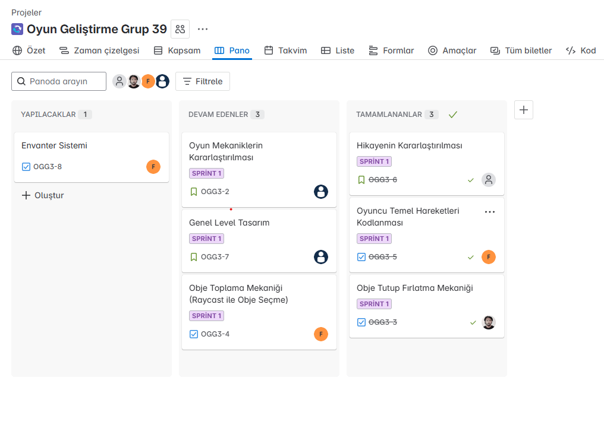
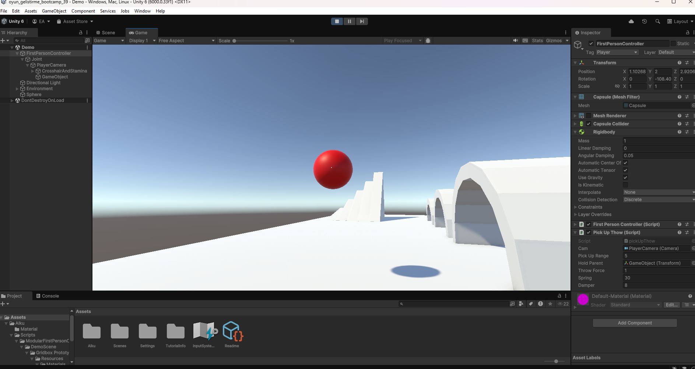

# Oyun Geliştrme Bootcamp Grup 39

Bu depo, Unity tabanlı oyun geliştirme bootcamp'inin 39. grubu için hazırlanmıştır. Aşağıda proje hakkında genel bilgileri ve çalışma talimatlarını bulabilirsiniz.

## İçindekiler

- [Takım Üyeleri](#takım-üyeleri)
- [Oyun Açıklaması](#oyun-açıklaması)
- [Oyun Hikayesi](#oyun-hikayesi)
- [Oyun Özellikleri](#oyun-özellikleri)
- [Sprint 1](#sprint-1)
- [Sprint 2](#sprint-2)

## Takım Üyeleri

| İsim           | Rol           |
| -------------- | ------------- |
| Sena Nür Ünal  | Product Owner |
| Emrullah Alku  | Scrum Master  |
| Furkan Beşirli | Developer     |
| Yavuz Avcu     | Developer     |
| İpek Demiral   | Developer     |

## Oyun Açıklaması

Oyunumuz, ilerledikçe karakterlerin duygusal yolculuklarına tanıklık ettiğimiz, sürükleyici ve atmosferik bir deneyim sunuyor. Oyuncular görevlerde ilerleyek Emir’in geçmişindeki sırları gün yüzüne çıkaracak ve onun içsel dünyasında dolaşacaklar.

## Oyun Hikayesi

Emir Yaman, 21 yaşında bir üniversite öğrencisi. Babası, okul notlarından ve başarıdan başka hiçbir şeye değer vermez; evde konuşulan tek konu hep bu olmuştur. Emir, yıllardır bu baskının gölgesinde yaşıyor, kendini ifade etmekten çekiniyor. Ders aralarında kampüs sokaklarında yalnız başına yürürken, kalbindeki boşluğu ve umutları arasında gidip gelir.

## Oyun Özellikleri

- 3D
- Tek Oyunculu
- Derik Hikaye Örgüsü

# Sprint 1

- **Sprint Notları**: [Sprind Board](https://emrullahalku.atlassian.net/jira/software/projects/OGG3/boards/35?atlOrigin=eyJpIjoiYWQyMGZjZDhkYzc0NDE5NGExMGEzZDAxOWM4MGRmZWYiLCJwIjoiaiJ9)
- **Sprint içinde tamamlanması tahmin edilen puan**: 50
- **Puan tamamlama mantığı**: Proje boyunca tamamlanması gereken toplam 400 puanlık backlog bulunmaktadır. 3 sprinte bölündüğünde ilk sprintin 50 ile başlaması gerektiği kararlaştırıldı.
- **Daily Scrum**: Daily Scrum toplantılarının Meets ve Slack üzerinden yapıldı. Daily Scrum toplantılarımız ve günlük Whatsapp konuşmalarımız [Imgur](https://imgur.com/a/shcnWhl)'da toplanmıştır
- **Sprint board update**: Sprint board screenshot: 

<strong>Oyun içi Screenshot</strong>

- **Sprint Review**:
  - Bütün ekip projede hangi kısımların bittiğini ve bunun hakkındaki görüşlerini iletti. Oyunun güncel gidişatının yavaş kalındığı dile getirildi. Onun dışında herhangi bir sorun ile karşılaşılmadı.
- **Sprint Retrospective**:

  - **İyi Gidenler**
    - Ekip içi iletişim kuvvetliydi.
    - Toplantılar zamanında yapıldı
  - **Geliştirilmesi Gerekenler**
    - Zaman yönetimi daha sıkı tutulmalı.
    - Karar aşamaları daha hızlı halledilmeli.
  - **Eylem Maddeleri**

    - Bir sonraki sprint'te, projenin somut adımlarına daha çok odaklanılacak.

    # Sprint 2

- **Sprint Notları**: [Sprind Board](https://emrullahalku.atlassian.net/jira/software/projects/OGG3/boards/35?atlOrigin=eyJpIjoiYWQyMGZjZDhkYzc0NDE5NGExMGEzZDAxOWM4MGRmZWYiLCJwIjoiaiJ9)
- **Sprint içinde tamamlanması tahmin edilen puan**: 150
- **Puan tamamlama mantığı**: Proje boyunca tamamlanması gereken toplam 400 puanlık backlog bulunmaktadır. 2. sprint için bu puan 150 olarak kararlaştırılmıştır.
- **Daily Scrum**: Daily Scrum toplantılarının Meets ve Slack üzerinden yapıldı. Daily Scrum toplantılarımız ve günlük Whatsapp konuşmalarımız [Imgur](https://imgur.com/a/WVFNq4R)'da toplanmıştır
- **Sprint board update**: Sprint board screenshot: 

<strong>Oyun içi Screenshot</strong>

- **Sprint Review**:
  - Bütün ekip projede hangi kısımların bittiğini ve bunun hakkındaki görüşlerini iletti. Oyunun güncel gidişatının hala yavaş kalındığı dile getirildi. Yeteri kadar toplantı yapılmadı ve iletişim zayıf kaldı. Onun dışında herhangi bir sorun ile karşılaşılmadı.
- **Sprint Retrospective**:
  - **Geliştirilmesi Gerekenler**
    - Zaman yönetimi daha sıkı tutulmalı.
    - Daha fazla toplantı yapılmalı
  - **Eylem Maddeleri**
    - Bir sonraki sprint'te, projenin somut adımlarına daha çok odaklanılacak.
    - Toplantı sıklığı arttıralacak
